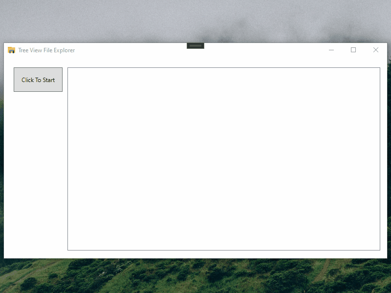

# tree_view_file_explorer
A simple application that can be used to keep an eye on your disk space and find out where it has gone. It scans your drive file systems, providing a clear overview of each element (directory, file) size. The application can be useful in case you are trying to clean up hard disk space, monitor free space, find space hogs or just have an overview over file information.

This application has the following architecture:

- Presentation layer: WPF with MVVM (C#, XAML, .NET Framework);
- Business layer: Class Library (C#, .NET Framework).

There are some additional project details (architecture, technologies/patterns used, etc.):
- WPF UI with MVVM pattern (Caliburn.Micro);
- Dependency injection (Simple IoC Container, comes pre-bundled with Caliburn.Micro);
- Multi-thread programming (parallel asynchronous file system scanning);
- Composite pattern (ITreeComponent);
- Decorator pattern (SizedFolder, SizedFile);
- Unit-tests (xUnit).

# P.s.

Please note, that I've shortened up file system loading time on the demo gif for presentation purposes. Actual loading time may vary depending on your machine's hardware, currently available resources and the overall size of your file system. 

# Demo:

